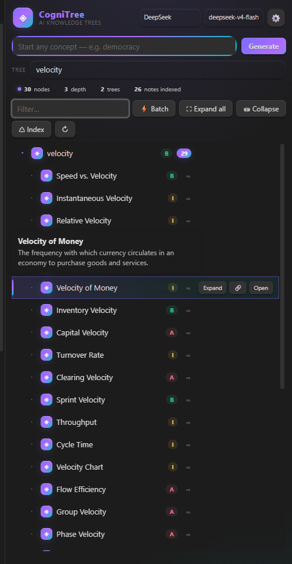
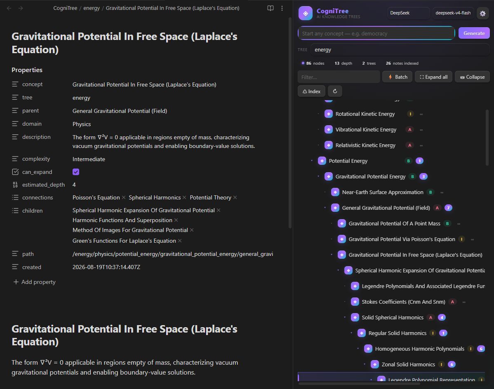
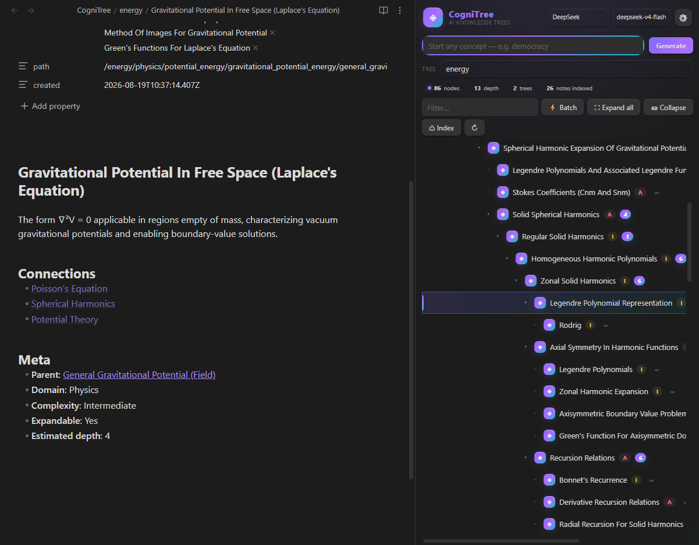
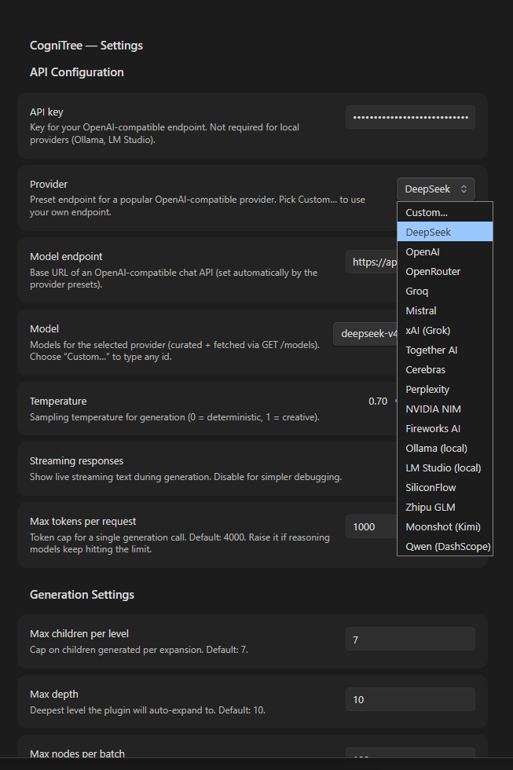
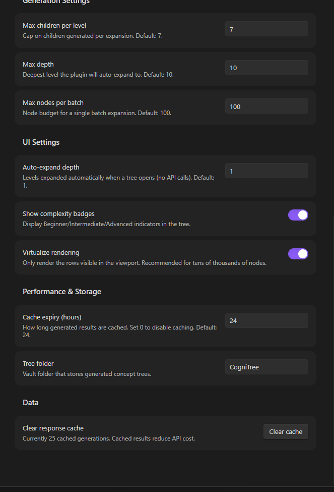

# CogniTree

AI-powered **branching knowledge trees** for Obsidian. Type a single concept ("democracy", "tree", "consciousness") and a polymathic-taxonomist LLM grows it into a deep, interconnected tree of notes — one branch at a time, up to tens of thousands of nodes.

Built around a **prompt system** (Discovery, Expansion, Connection Discovery, Deep Dive, Review Cards, Vault Cartography, plus a Batch Generation builder) and designed for **large-scale scalability**: incremental growth, Markdown+frontmatter storage, response caching, background indexing via Obsidian's `metadataCache`, and virtualized rendering.

---

## Features

| Capability | How |
|---|---|
| **Discovery** (root concept) | Polymathic taxonomist prompt → 3–7 domains × 3–5 children |
| **Expansion** (drill deeper) | Knowledge-graph engineer prompt → 5–10 granular sub-concepts with `can_expand` / `estimated_depth` |
| **Connection Discovery** | Ranked vault-note candidates (lexical index **+ semantic embeddings**) → relationship types + priorities; link or create notes |
| **Deep dive per note** | Right-click a node → **Write deep dive** — a 350–600 word structured section (mechanism, examples, common confusions, open questions) written into the note's `## Deep dive` region. **Deep dive subtree** does it branch-wide on a budget; hand edits survive every rewrite |
| **Review (spaced repetition)** | **Create review cards** per node or subtree, then study them in a keyboard-driven session (Space reveals, 1–4 grade). SM-2-lite scheduling lives in a hidden per-tree store, with a **cards due** chip in the stats row |
| **Grow a tree from your vault** | **Grow a tree from your vault…** turns notes you *already have* into a tree: it reads names, tags and links from `metadataCache`, has the model arrange them, and writes *reference nodes* that link to the originals instead of copying them |
| **Semantic index** | Optional `/embeddings` pass over your vault (incremental, budgeted, cached next to the plugin) that powers connection matching and gives *Ask* related notes from outside the tree |
| **Ask & follow-up chat** | Grounded Q&A on any node: branch digest + linked vault notes + semantic neighbours, Explain / Quiz / Critique / Expansion presets, adoptable *Suggested children* |
| **Batch expansion** | Level-by-level BFS with bounded concurrency, node budget, live progress bar |
| **Incremental growth** | Never generate the whole tree at once; expand branches on demand |
| **Markdown storage** | One note per concept, full frontmatter (parent, domain, complexity, children, connections, path), wikilink `## Connections` section |
| **Response cache** | Identical queries hit the cache (LRU, expiry, disabled at `0`) |
| **Background indexing** | Vault note names/tags indexed from `metadataCache` — powers connection matching without loading files |
| **Virtualized rendering** | Only visible rows are in the DOM; smooth with tens of thousands of nodes |
| **Any OpenAI-compatible API** | DeepSeek (default), OpenAI, OpenRouter, Ollama, LM Studio… with optional SSE streaming |

### Tree interaction

| Feature | How |
|---|---|
| **Hover preview** | Hover a node → tooltip with its description; the same preview follows keyboard selection |
| **Keyboard navigation** | **↑ / ↓** move the selection, **→** expand, **←** collapse, **Enter** toggle — preview follows the selected node |
| **Filter that jumps** | Type in the search box: matching nodes keep their ancestor chain, matches are highlighted, and the view jumps to the first hit; a *No matching nodes* hint appears when nothing matches |
| **Copy link / path** | Right-click → **Copy [[link]]** or **Copy note path** |
| **Safe delete with undo** | Right-click → **Delete node + descendants**, then press **Undo** on the notice to recreate every deleted note *and* re-attach the branch to its parent. Reference nodes never delete the notes they point at |
| **Export tree** | Right-click → **Export tree…** → Markdown outline, JSON snapshot, or SVG graph, written to the vault root |
| **Batch connections** | Right-click → **Find connections in subtree** — runs the connection pass over every node and auto-links high-priority hits |
| **Tree stats & health** | Right-click → **Tree stats & health** — depth distribution, complexity breakdown, orphaned / dangling-node detection |
| **Duplicate detection** | Right-click → **Find duplicates across trees** — lists concepts present in 2+ trees with **Link** and **Merge A→B / B→A** actions |
| **Ask about a concept** | Right-click (or the row's **💬**) → a grounded chat on that node: *Explain*, *Quiz me*, *Gaps & contradictions*, *Next expansion* presets or any free question. Answers are anchored in a digest of the branch + linked vault notes + semantically related notes elsewhere in the vault, and *Suggested children* can be adopted straight into the tree |
| **Deep dive** | Right-click → **Write / Refresh / Remove deep dive**, or **Deep dive subtree…** for a budgeted branch-wide pass; the row's **💡** button does the same, and a 💡 badge marks notes that have one |
| **Review** | Right-click → **Create review cards**, **Create review cards for subtree**, **Review this subtree**, or the toolbar's **🧠 Review** for everything due in the tree |
| **Batch without collapsing** | Batch expansion preserves the current expansion state, then expands the batch subtree afterwards |
| **Expand all / Collapse** | Toolbar buttons to show or hide the whole tree at once |
| **Manual reindex** | **♺ Index** toolbar button (or the *Reindex vault notes* command) rebuilds the lexical vault index on demand |
| **Jump to the source** | A reference node (🔗 badge) opens the note it points at when you double-click it or choose **Open source note** |

---

## Quick start

1. **Install** — copy `main.js`, `manifest.json`, `styles.css` into `<vault>/.obsidian/plugins/cognitree/` and enable the plugin. (Or `git clone` and run `npm run build`.)
2. **Set your API key** — ribbon icon 🕸 *Open CogniTree* → **⚙** in the header → paste your key (defaults to DeepSeek + `deepseek-v4-flash`). To use another provider, pick it from the **Provider** dropdown — the endpoint and model list switch automatically (Ollama / LM Studio need no key).
3. **Generate a tree** — type `democracy` in the input and press **Generate**. The Discovery prompt creates the root + domain children as notes under `CogniTree/Democracy/`.
4. **Explore** — click a row to select (or use **↑ / ↓** to navigate with the keyboard and a live preview tooltip); use **Expand** (Expansion prompt), **💬** (Ask about this concept), **🔗** (Find connections), **💡** (write/refresh the note's deep dive), **Batch expand** (subtree to a depth), hover for the description preview, right-click for the context menu (ask, deep dive, review cards, copy, export, stats, duplicates, safe delete), double-click to open the note, and **⛶ Expand all** / **⛁ Collapse** / **♺ Index** / **🧠 Review** from the toolbar.
5. **Fill the notes in and remember them** — **💡 Deep dive** or **Deep dive subtree…** writes real substance into each note; **🧠 Review** (or right-click → **Create review cards**) turns them into spaced-repetition cards.
6. **Or start from what you already have** — run **Grow a tree from existing vault notes** and pick the note you're reading or one of your tags: CogniTree arranges those notes into a tree and links them (🔗) instead of copying them.

Example flow: `democracy` → Discovery → *Political Science / Direct Democracy / Referendums* → click **Referendums** → Expansion → *Mandatory / Optional / Popular Initiative* → **🔗 Find connections** → link to *Elections*, *Switzerland*, *Popular Sovereignty*.

---

## Settings

Mirrors the spec's `PluginSettings`:

| Setting | Default | Purpose |
|---|---|---|
| `apiKey` | — | Key for the OpenAI-compatible endpoint (not needed for local providers) |
| **Provider** | — | Preset picker: DeepSeek, OpenAI, OpenRouter, Groq, Mistral, xAI, Together, Cerebras, Perplexity, NVIDIA NIM, Fireworks, SiliconFlow, Zhipu GLM, Moonshot, Qwen (DashScope), Ollama, LM Studio, or Custom… |
| `modelEndpoint` | `https://api.deepseek.com` | Base URL (`/chat/completions` is appended if missing) |
| `model` | `deepseek-v4-flash` | Model id — dropdown lists the provider's curated models + anything fetched via `GET /models`; **Custom…** accepts any id |
| `temperature` | `0.7` | Sampling temperature |
| `streaming` | `true` | Request SSE streaming (Obsidian buffers the body, so text is revealed when the request completes) |
| `maxTokensPerRequest` | `4000` | Token cap per call (reasoning models auto-retry with a larger budget if they run out mid-reasoning) |
| `maxChildrenPerLevel` | `7` | Children cap per expansion |
| `maxDepth` | `10` | Deepest auto/batch expansion level |
| `maxNodesPerBatch` | `100` | Node budget for batch expansion |
| `autoExpandDepth` | `1` | Levels auto-expanded on open (no API calls) |
| `showComplexity` | `true` | Beginner/Intermediate/Advanced badges |
| `virtualizeRendering` | `true` | Windowed rendering (recommended for large trees) |
| `cacheExpiryHours` | `24` | Cache TTL; `0` disables caching |
| `treeFolder` | `CogniTree` | Vault folder holding generated trees |
| `askContextMaxNodes` | `60` | Nodes included in the grounding context of an **Ask** question |
| `askContextMaxChars` | `10000` | Character budget for that grounding context (protects small-context models) |
| `askUseSemantic` | `true` | Add semantically related vault notes to the Ask grounding context |
| `embeddingModel` | — | Model id for `/embeddings`; empty disables semantic matching (matching stays lexical: names + tags) |
| `embeddingMaxNotes` | `300` | Vault notes embedded per index run; re-run to continue |
| `reviewCardsPerNode` | `3` | Flashcards generated per concept |
| `vaultTreeMaxNotes` | `60` | Notes offered to the model when growing a tree from your vault |

Also: **Clear cache** (N cached generations), **Build / Clear semantic index**, and **tree folder** relocation.

---

## The prompt system

The prompts from the spec are implemented verbatim in [`src/prompts.ts`](src/prompts.ts) — plus follow-up, deep-dive, review-card and cartography prompts:

1. **Discovery Prompt** — *"You are a polymathic taxonomist and knowledge graph engineer…"* — 3–7 domains, 3–5 children each, complexity ratings, connection hints, `suggested_starting_branch`. Strict JSON schema.
2. **Expansion Prompt** — *"You are a knowledge graph engineer specializing in deep taxonomic expansion…"* — 5–10 granular children, sibling de-duplication context, `can_expand` + `estimated_depth` depth indicators.
3. **Connection Discovery Prompt** — *"You are a knowledge graph analyst…"* — ranked candidate vault notes, `relationship_type` (parent-of / related-to / contrast-with…), High/Medium/Low priority, suggestions for concepts to create.
4. **Batch Generation Prompt** — *"You are a batch knowledge expansion specialist…"* — complete subtree to a depth within a node budget (`path`-based hierarchical output). *Builder only:* no UI action sends it today — **⚡ Batch** generates the subtree with repeated Expansion prompts, one branch at a time (`ConceptGenerator.batch`), which is what keeps the node budget and progress bar honest.
5. **Follow-up (Ask) Prompt** — *"You are CogniTree Ask…"* — a grounded tutor over the focused node's branch digest. Answers stay anchored in the digest (plus linked vault notes), keep Markdown short, and — when the answer proposes new sub-concepts — end with a `### Suggested children` bullet list that the chat can adopt into the tree.
6. **Deep Dive Prompt** — *"You are CogniTree Deep Dive…"* — plain **Markdown**, not JSON: mechanism, examples, precise contrasts, open questions and next concepts for one node, written into the note's `## Deep dive` region.
7. **Review Cards Prompt** — *"You are CogniTree Review…"* — 1–N flashcards per node (recall / cloze / application) with one fact per card and answers that stand alone.
8. **Vault Cartography Prompt** — *"You are CogniTree Cartographer…"* — arranges **existing** vault notes into domains and children, marking each slot that maps to a real note via `source` (validated before it becomes a link).

Responses are parsed tolerantly (markdown-fence stripping, trailing-comma repair, balanced-brace extraction) in [`src/parser.ts`](src/parser.ts).

## Scalability design (tens of thousands of nodes)

- **Incremental growth** — one branch per API call; the tree only exists where you've explored it.
- **Lazy loading** — tree models are rebuilt from `metadataCache` frontmatter (no full-file reads); a raw YAML parse is the fallback for notes Obsidian hasn't indexed yet.
- **Virtualized rendering** — fixed 34px rows, windowed DOM (`src/treeView.ts`), ~50 rows in the DOM regardless of tree size.
- **Prompt caching** — keyed `kind|model|prompt`, LRU-capped, persisted in the plugin data file.
- **Background indexing** — `VaultIndexer` subscribes to `metadataCache` `changed`/`deleted`/`resolved` (debounced) and ranks candidate note names by token overlap.
- **Semantic index (optional)** — `SemanticIndex` embeds note titles, tags and the head of each body via `/embeddings`, keeps vectors in `<plugin>/embeddings.json`, skips notes whose `mtime` is unchanged, and caps memory at 20 000 vectors. Runs are budgeted (`embeddingMaxNotes`) and resumable.
- **Bounded batch concurrency** — 3 parallel expansion requests per level, node budget enforced, progress `done/total` reported to the UI.

## Note format

Every concept is one Markdown note, e.g. `CogniTree/Democracy/Direct Democracy.md`:

```markdown
---
concept: "Direct Democracy"
tree: "Democracy"
parent: "Democracy"
domain: "Political Science"
description: "Citizens vote directly on laws and policies rather than through representatives."
complexity: "Beginner"
can_expand: true
estimated_depth: 4
connections: ["Athenian Democracy", "Referendums", "Citizen Assemblies"]
children: ["Referendums", "Citizen Assemblies"]
path: "/democracy/political_science/direct_democracy"
deepened: "2025-01-02T09:15:00.000Z"
source: "Notes/Greek Democracy.md"
created: "2025-01-01T00:00:00.000Z"
---

# Direct Democracy

> Source note: [[Notes/Greek Democracy]]

Citizens vote directly on laws and policies rather than through representatives.

## Deep dive
<!-- cognitree:deep-dive -->
### How it works
…

## Connections
- [[Athenian Democracy]]
- [[Referendums]]
```

This stays fully Obsidian-native: the graph view, backlinks, and search all work on generated trees. Three optional extras:

- **`deepened`** — set when a `## Deep dive` region exists, so the tree view can badge notes (💡) and skip them in a batch without reading any file.
- **`source`** + the `> Source note:` line — a *reference node* created by **Grow a tree from your vault**: it points at a note you already own (🔗 badge, **Open source note**). Deleting the node deletes only the pointer, never your note.
- **`.cognitree-review.json`** — hidden per-tree store holding review cards and their SM-2-lite schedule. It lives inside the tree folder, travels with the tree, and is invisible to Obsidian's search and file explorer.

The deep-dive region is delimited by the `<!-- cognitree:deep-dive -->` marker and ends at the next `## ` heading: the plugin rewrites the rest of the note body freely, but everything inside those markers — including your own edits — is carried over on every write.

## Development

```bash
npm install          # dev deps (esbuild, typescript, obsidian types)
npm run dev          # watch mode → main.js
npm run build        # typecheck + production bundle
npm test             # pure-logic suite + store/generator suite (in-memory vault stub)
```

`tests/smoke.ts` covers the obsidian-free helpers (parser, note regions, providers, branch digest, semantic math, SRS scheduling, vault graph). `tests/store.test.ts` runs the real `ConceptStore` / `ConceptGenerator` against `tests/stub-obsidian.ts` — an in-memory vault, metadataCache and fileManager — so note writing, deep-dive preservation, subtree deletes/undo, merges, review stores and reference-node trees are testable without an Obsidian install.

## Keyboard shortcuts

| Key | Action |
|---|---|
| **↑ / ↓** | Move the selection (description preview follows) |
| **→** | Expand the selected node |
| **←** | Collapse the selected node |
| **Enter** | Toggle expand / collapse |
| **Tab** | Focus the tree list (then use the arrows above) |

In a review session: **Space** reveals the answer, **1 / 2 / 3 / 4** grade it *again / hard / good / easy*, **Esc** ends the session (grades are saved as you go).

Click any node once to grab keyboard focus for the list. The toolbar actions (**⚡ Batch**, **♺ Index**, **🧠 Review**) act on the currently selected node.

## Commands

- **Open panel**
- **Create concept tree from selection** — uses the current editor selection as the root concept
- **Refresh from vault** — reload trees if you edited notes by hand
- **Reindex vault notes** — rebuild the lexical connection index on demand
- **Build semantic index (embeddings)** — embed new/changed vault notes for semantic matching
- **Ask about selected concept** — grounded Q&A chat on the selected node (or the tree root)
- **Review due cards** — study the cards that are due in the open tree
- **Grow a tree from existing vault notes** — arrange notes you already have into a new tree (linked, not copied)

## Screenshots











## License

MIT © 2026 Kerekes Stefan
